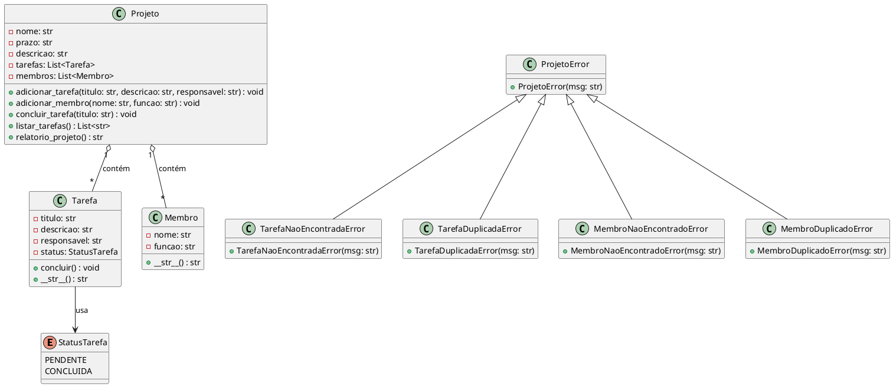

# 📌 Projeto: Gerenciador de Projetos e Tarefas

Este projeto é um **gerenciador de projetos e tarefas**, desenvolvido em Python para demonstrar:

* **Modelagem clara de entidades**
* Aplicação dos **princípios SOLID**
* **Tratamento de exceções robusto**
* **Testes unitários automatizados**
* Estrutura **modular e de fácil manutenção**

---

## 📁 Estrutura de Arquivos

```
📦 projeto/
 ├── enums.py           # Enum para StatusTarefa
 ├── exceptions.py      # Hierarquia de exceções personalizadas
 ├── models.py          # Classes Projeto, Tarefa, Membro
 ├── test_projeto.py    # Testes unitários com pytest
 └── README.md          # Documentação do projeto
```

---

## 🗂️ Entidades Principais

| Classe                      | Descrição                                                                                         |
| --------------------------- | ------------------------------------------------------------------------------------------------- |
| **Projeto**                 | Classe principal, gerencia tarefas e membros, gera relatórios.                                    |
| **Tarefa**                  | Representa uma atividade com título, descrição, responsável e status (`PENDENTE` ou `CONCLUIDA`). |
| **Membro**                  | Representa um integrante da equipe com nome e função.                                             |
| **StatusTarefa (Enum)**     | Define estados possíveis para uma tarefa.                                                         |
| **Exceções Personalizadas** | Capturam erros específicos como duplicidade ou ausência de tarefas/membros.                       |

---

## ⚙️ Principais Métodos

### ✅ Projeto

* `adicionar_tarefa(titulo, descricao, responsavel)`
  Adiciona nova tarefa, valida duplicidade.

* `adicionar_membro(nome, funcao)`
  Adiciona novo membro, valida duplicidade.

* `concluir_tarefa(titulo)`
  Marca uma tarefa como concluída.

* `listar_tarefas()`
  Retorna lista de tarefas formatadas.

* `relatorio_projeto()`
  Gera relatório completo do projeto.

---

### ✅ Tarefa

* `concluir()`
  Marca tarefa como concluída.

* `__str__()`
  Retorna representação textual da tarefa.

---

### ✅ Membro

* `__str__()`
  Retorna representação textual do membro.

---

## 🗂️ Diagrama de Classes UML



---

## 💡 Princípios SOLID Aplicados

| Princípio | Aplicação                                                        |
| --------- | ---------------------------------------------------------------- |
| **SRP**   | Cada classe tem uma única responsabilidade.                      |
| **OCP**   | Fácil estender novas funções sem alterar o código base.          |
| **LSP**   | Subclasses de `ProjetoError` substituem a classe base sem erros. |
| **ISP**   | Cada classe expõe apenas o necessário.                           |
| **DIP**   | O código depende de abstrações como `Enum` e exceções genéricas. |

---

## ✅ Testes

* **Framework:** `pytest`
* **Arquivo:** `test_projeto.py`
* **Cobertura:**

  * Adição de tarefas/membros
  * Validação de duplicidade
  * Conclusão de tarefas
  * Relatórios

---

## 🧪 Executar os Testes

1️⃣ Instale o `pytest`:

```bash
pip install pytest
```

2️⃣ Execute na raiz do projeto:

```bash
pytest test_projeto.py
```

---

## 🚀 Manutenção Futura

* Possível adicionar persistência em banco de dados.
* Fácil integrar com uma interface web ou API REST.
* Diagrama de classes pode ser atualizado junto com a evolução do sistema.

---
